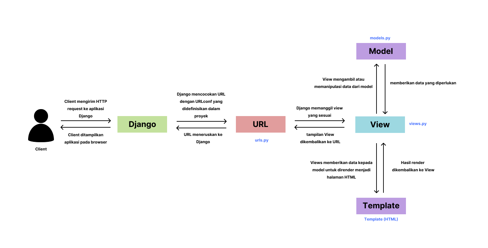

Zhafira Uzma || 2406495451 || PBP C

link pws : https://zhafira-uzma41-luckykicks.pbp.cs.ui.ac.id/

1. Jelaskan bagaimana cara kamu mengimplementasikan checklist di atas secara step-by-step (bukan hanya sekadar mengikuti tutorial).
= Secara garis besar, saya mengikuti langkah-langkah yang ada pada tutorial untuk mengerjakan tugas mandiri ini, namun ada beberapa hal yang saya ubah untuk menyesuaikan dengan tugas individu. Ketika saya membuat proyek Django baru, saya melakukan beberapa perubahan seperti dari langkah tutorial membuat direktori baru dengan nama lucky-kicks (sesuai dengan nama toko yang akan saya buat), membuat direkotri proyek Django dengan nama lucky_kicks, mengganti SCHEMA menjadi SCHEMA = tugas_individu pada file .env.prod, membuat repositori dengan nama lucky-kicks pada Github dan menghubungkannya dengan direktori lokal, serta mengisi mengisi Project Name dengan luckykicks pada website PBP untuk mendapatkan url yang ada di atas. Untuk membuat aplikasi 'main' dan melakukan routing agar aplikasi berjalan, saya tidak melakukan perubahan dari langkah yang ada pada tutorial. Ketika membuat model pada aplikasi 'main', saya membuat nama model Product dengan atribut yang sesuai dengan ketentuan soal dan menambahkan atribut sendiri yaitu brand sebagai brand item dengan tipe Charfield, stok sebagai stok item dengan tipe IntegerField, dan view sebagai jumlah viewers item dengan tipe IntegerField. Untuk langkah-langkah terakhir seperti membuat fungsi pada views.py untuk template HTML menampilkan nama aplikasi, membuat routing pada aplikasi main untuk memetakan fungsi pada views.py dan deployment ke PWS, saya lakukan sesuai dengan tutorial sehingga ketika seseorang meng-click link yang ada di atas, mereka dapat melihat aplikasi yang saya buat melalui internet.

2. Buatlah bagan yang berisi request client ke web aplikasi berbasis Django beserta responnya dan jelaskan pada bagan tersebut kaitan antara urls.py, views.py, models.py, dan berkas html.

= urls.py di bagan tersebut bergungsi sebagai peta router dan setiap pola URL yang diterima akan diarahkan ke fungsi dan class yang ada di views.py
views.py berisi logika utama dari aplikasi yang terhubung ke model dan template. views.py akan mengakses database dari models.py jika diperlukan dan akan mengembalikan data tersebut ke views.py. Setalah mendapatkan data dari models.py, data tersebut akan diteruskan ke template untuk dirender menjadi bentuk Template HTML. Selesai rendering, Template HTML akan dikembalikan ke views.py dan diteruskan oleh Django sebagai respon untuk client

3. Jelaskan peran settings.py dalam proyek Django!
= peran settings.py dalam proyek Django adalah sebagai konfigurasi proyek yang menentukan dasar informasi aplikasi. Hal ini memastikan Django mengetahui aplikasi yang dibuat dan middleware yang digunakan. Django juga berfungsi sebagai pengaturan database yang menentukan tipe database dan detail koneksi. Untuk sisi keamanan, Django berfungsi untuk memastikan keamanan aplikasi dengan SECRET_KEY, DEBUG, dan ALLOWED_HOSTS agar aplikasi tidak rentan terhadap serangan siber.

4. Bagaimana cara kerja migrasi database di Django?
= migrasi database merupakan mekanisme untuk sinkronisasi perubahan yang ada di models.py dengan database. Alur kerja dari database adalah dimulai dengan membuat atau mengubah model pada models.py. Lalu, membuat file migrasi dengan makemigrations untuk 'mencatat' perubahan model. Kemudian, menerapkan migrasi di terminal dengan migrate. Setelah melakukan migrasi, database akan diperbarui sesuai dengan file models.py

5. Menurut Anda, dari semua framework yang ada, mengapa framework Django dijadikan permulaan pembelajaran pengembangan perangkat lunak?
= menurut saya, Django memiliki aturan dan struktur proyek yang jelas. Django secara otomatis membuat beberapa folder dan file dasar sehingga jika seorang pemula yang sedang belajar untuk membuat sebuah aplikasi, mereka cukup mengikuti aturan Django maka proyek dapat berjalan tanpa harus setting segalanya dari awal. Karena hal ini, Django menjadi framework yang mudah dipahami oleh banyak orang sehingga cocok untuk pemula yang baru mulai belajar mengembangkan aplikasi.

6. Apakah ada feedback untuk asisten dosen tutorial 1 yang telah kamu kerjakan sebelumnya?
= Tidak ada karena kemarin ketika saya melakukan tutorial dan mengalami kesulitan, para asdos selalu open hand untuk membantu dan menjawab pertanyaan dari saya dengan jelas dan mudah dipahami. 